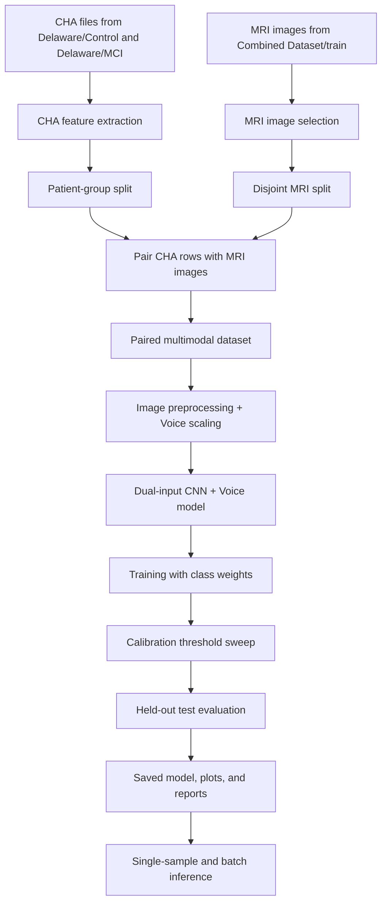
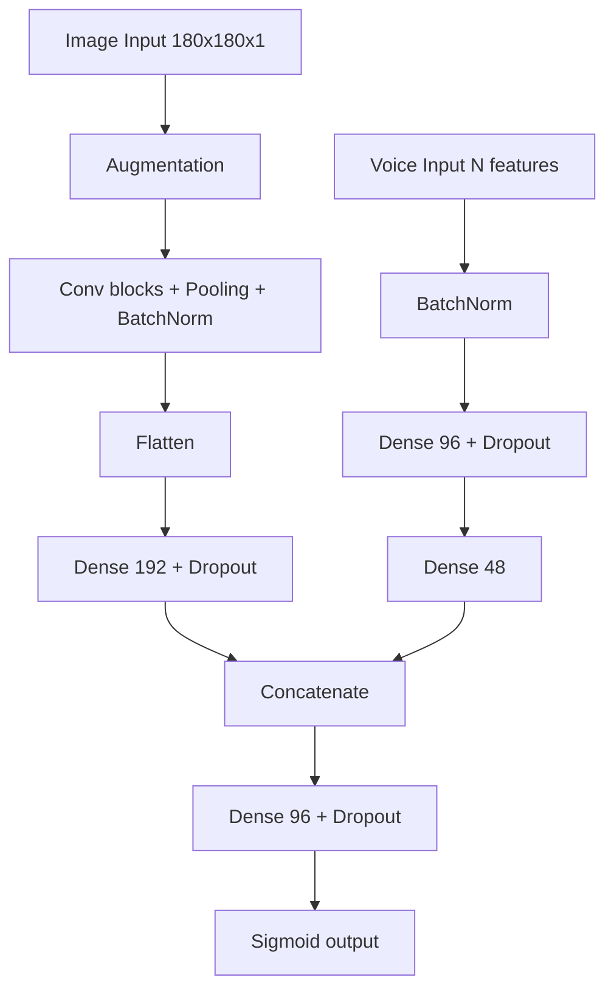

# CNN + CHA Fusion Project: End-to-End Process

This document is a presentation-ready explanation of the project in `cnn_cha_fusion_pipeline_v2.ipynb`. It covers what the system does, why multimodal learning is used, how the architecture is organized, and why each major design choice was made.

---

## 1) Problem Statement

The goal of this project is to classify dementia-related cognitive status using two complementary data sources:

- MRI images, which provide structural brain information
- CHA speech transcripts, which provide language, timing, and pause-pattern information

The task is binary classification:

- `0 = Control`
- `1 = MCI`

The main idea is that dementia-related changes are not always visible in only one modality. MRI can capture anatomical patterns, while speech can capture cognitive-linguistic behavior. Combining them gives the model more evidence than either source alone.

---

## 2) Why We Use Multimodal Learning

We use multimodal learning because dementia is a complex condition and no single signal is enough in every case.

### Why MRI alone is not enough
- MRI shows brain structure, but some early or mild cases can be visually subtle.
- A CNN can learn spatial patterns, but it may miss functional or behavioral signs.

### Why speech alone is not enough
- Speech transcripts capture pauses, response time, word duration, and speech rate.
- These features are useful, but they do not directly show structural changes in the brain.

### Why combining both helps
- MRI and speech are complementary signals.
- If one modality is noisy or ambiguous, the other can provide supporting evidence.
- The fusion model is more robust than a single-modality model because it learns from both anatomy and behavior.

In short: multimodal learning is used because dementia detection is stronger when the model can see both what the brain looks like and how the person speaks.

---

## 3) High-Level Architecture

This architecture follows a practical pipeline: extract features, build paired examples, train a dual-input model, tune the threshold carefully, and then evaluate and export artifacts.

---

## 4) Whole Process, Step by Step

## Step 1: Load and organize the data

The notebook starts by defining the project root and setting paths for:

- CHA speech files in `Delaware/Control` and `Delaware/MCI`
- MRI images in `Alzheimers-Disease-Classification/Combined Dataset/train`
- Output folders in `cnn_cha_fusion/data` and `cnn_cha_fusion/artifacts`

This makes the pipeline reproducible and keeps all generated outputs in one place.

---

## Step 2: Extract CHA voice features

Each `.cha` transcript is processed with `pause_cha_word_by_word.get_report(...)`.

From every CHA file, the notebook extracts features such as:

- `word_count`
- `pause_count`
- `total_speech_time`
- `total_pause_time`
- `speech_rate_wpm`
- `pause_per_word_ratio`
- `pause_per_speech_sec`
- `mean_word_duration`
- `std_word_duration`
- `mean_silence_duration`
- `std_silence_duration`
- `max_silence_duration`
- `silence_ratio`
- `response_time_count`
- `response_time_mean`
- `response_time_std`
- `response_time_median`

These features summarize the speaking behavior of the patient. They are important because cognitive decline often affects fluency, timing, and pause structure.

---

## Step 3: Split CHA data by patient group

The CHA dataset is split using `GroupShuffleSplit` with `patient_id` as the group.

Why this matters:

- The same patient should not appear in both train and test sets.
- This reduces data leakage.
- It gives a more realistic estimate of generalization.

This is one of the most important design decisions in the notebook.

---

## Step 4: Prepare MRI image pools

The MRI dataset is loaded from the Alzheimer image folders and limited by `MAX_IMAGES_PER_CLASS`.

The notebook creates disjoint image pools for train and test:

- `No Impairment`
- `Mild Impairment`

The image split is separate from the CHA split so that the model does not reuse the same MRI files across train and test.

---

## Step 5: Build paired multimodal samples

The notebook creates one multimodal row by combining:

- one CHA feature row
- one MRI image path from the mapped class pool

The label mapping is:

- Control CHA -> No Impairment MRI
- MCI CHA -> Mild Impairment MRI

This pairing strategy is used to build a multimodal training set even though the original source data is not naturally patient-matched across both modalities.

Why this is done:

- The project needs a fused dataset to train the model.
- The mapping makes the two modalities consistent at the class level.
- It allows the network to learn how speech and MRI patterns relate to the same diagnosis group.

Important note:

- This is diagnosis-level pairing, not true one-to-one patient-level pairing.
- That means the setup is useful for development and demonstration, but it is not the same as a clinically perfect matched multimodal dataset.

The paired data is saved to:

- `cnn_cha_fusion/data/paired_image_cha_dataset_v2.csv`

---

## Step 6: Prepare model inputs

Before training, the notebook converts inputs into tensors:

### MRI branch input
- Image is loaded with PIL
- Converted to grayscale
- Resized to `180 x 180`
- Normalized to `[0, 1]`
- Expanded to shape `180 x 180 x 1`

### Voice branch input
- CHA feature columns are selected
- `StandardScaler` is fit on train data
- The same scaler is applied to validation and test data

This keeps both branches ready for neural network training.

---

## Step 7: Build the dual-input architecture

The model has two branches.

### Image branch
- Data augmentation
- Several Conv2D blocks
- Max pooling and batch normalization
- Flatten layer
- Dense embedding layer
- Dropout for regularization

### Voice branch
- Batch normalization
- Dense layers
- Dropout
- Compact voice embedding

### Fusion head
- Concatenate image and voice embeddings
- Dense fusion layer
- Dropout
- Sigmoid output for binary prediction

Why this architecture works:

- The CNN learns spatial MRI patterns.
- The MLP learns speech-pattern structure.
- The fusion layer learns how both signals interact.
- Dropout and L2 regularization help reduce overfitting.

---

## Step 8: Train the model carefully

The notebook uses:

- Binary cross entropy loss
- Adam optimizer
- Class weights
- Early stopping
- ReduceLROnPlateau

Why class weights are used:

- The model should not simply favor the majority class.
- MCI is especially important to detect, so the notebook boosts MCI weight slightly.

Why early stopping and LR scheduling are used:

- They stabilize training.
- They prevent wasted epochs.
- They help the model converge without overfitting too hard.

The notebook also uses a custom validation balanced accuracy callback so that validation monitoring is not based only on raw accuracy.

---

## Step 9: Tune the decision threshold

The model outputs a probability of MCI. Instead of always using `0.5`, the notebook sweeps many thresholds on a calibration split.

Why threshold tuning is important:

- In medical classification, false negatives can be costly.
- A threshold of `0.5` is not always the best operating point.
- Calibration lets us balance Control recall and MCI recall.

The notebook searches for a threshold that:

- improves MCI recall
- keeps Control recall reasonable
- reduces imbalance between the two classes

This makes the final decision rule more clinically practical than a default threshold.

---

## Step 10: Evaluate on the held-out test set

After threshold selection, the model is evaluated on unseen test data.

The notebook reports:

- classification report
- confusion matrix
- accuracy
- balanced accuracy
- precision and recall for both classes
- training curves
- confusion matrix plot

These outputs show whether the fusion model is learning meaningful patterns or just memorizing the training set.

---

## Step 11: Save artifacts

The notebook saves:

- trained Keras model
- training curves plot
- confusion matrix plot
- JSON report with metrics and threshold information
- paired dataset CSV

This is important because it makes the work reproducible and easier to present.

Saved artifacts are stored in:

- `cnn_cha_fusion/artifacts`

---

## Step 12: Run inference on new data

The notebook also supports prediction on a single new sample or a batch of unseen samples.

Inference flow:

1. Load a CHA file
2. Extract CHA features
3. Load an MRI image
4. Preprocess both inputs
5. Scale voice features with the saved scaler
6. Predict with the trained fusion model
7. Apply the selected threshold
8. Return Control or MCI

This shows that the project is not only a training experiment. It also supports practical inference.

---

## 5) Why This Architecture Was Chosen

This project uses a CNN plus tabular voice fusion design because it is a good match for the data.

### CNN for MRI
- CNNs are strong at spatial pattern recognition.
- MRI images contain local visual patterns that convolution layers can detect.

### MLP for speech features
- CHA features are already numeric and structured.
- Dense layers are appropriate for learning from tabular data.

### Late fusion by concatenation
- Each branch first learns its own representation.
- The fusion layer combines both learned embeddings.
- This is simple, stable, and easy to explain in a presentation.

### Regularization choices
- Augmentation helps the image branch generalize.
- Dropout helps reduce overfitting.
- L2 penalty discourages overly complex weights.

The architecture is intentionally practical rather than overly complicated.

---

## 6) What Makes This Project Important

This project matters because it models a realistic medical AI idea:

- cognitive disease is multi-factorial
- one source of evidence is often incomplete
- multimodal fusion can improve robustness and interpretability

It also demonstrates a full workflow, not just a single model:

- data preparation
- feature extraction
- split design
- fusion modeling
- threshold calibration
- evaluation
- artifact export
- inference

That makes it a complete end-to-end machine learning pipeline.

---

## 7) Limitations You Should Mention in Your Presentation

Be honest about the current limits:

- The pairing is diagnosis-level, not true patient-matched MRI + speech.
- The dataset is limited in size compared with what a clinical system would need.
- Threshold tuning improves operating behavior, but it does not replace proper external validation.
- Final medical use would require stronger data collection, calibration, and clinical review.

Mentioning these limitations shows that you understand the difference between a research prototype and a deployable diagnostic tool.

---

## 8) Short Presentation Summary

If you need a short spoken summary, use this:

"This project uses a multimodal deep learning pipeline that combines MRI images and CHA speech features to classify Control versus MCI. We use multimodal learning because MRI captures structural brain information while speech captures cognitive and timing behavior. The system extracts CHA features, preprocesses MRI images, pairs them into a fused dataset, trains a dual-input CNN plus tabular model, tunes the threshold on a calibration split, and evaluates the final model on held-out test data. The result is a more robust and clinically meaningful approach than using either modality alone." 

---

## 9) Main Files Involved

- `cnn_cha_fusion/cnn_cha_fusion_pipeline_v2.ipynb`
- `cnn_cha_fusion/CNN_CHA_FUSION_PIPELINE_GUIDE.md`
- `cnn_cha_fusion/CNN_CHA_FUSION_LAYER_BLOCK_DIAGRAM.md`
- `pause_cha_word_by_word.py`
- `Alzheimers-Disease-Classification/Combined Dataset/train`
- `Delaware/Control`
- `Delaware/MCI`

---

## 10) Bottom Line

The project is built around a simple idea: MRI and speech each capture different parts of the disease signal. By combining them in one model, the pipeline aims to make classification more robust, more realistic, and easier to explain than using a single modality alone.
